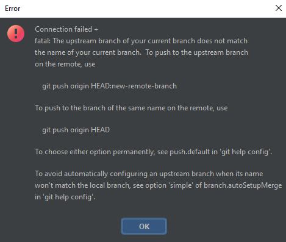

<pre>
   ____                          _   _   ____       _              _       _           
  / ___|___  _ __ ___  _ __ ___ (_)| |_/ ___|  ___| |__   ___  __| |_   _| | ___ _ __ 
 | |   / _ \| '_ ` _ \| '_ ` _ \| || __\___ \ / __| '_ \ / _ \/ _` | | | | |/ _ \ '__|
 | |__| (_) | | | | | | | | | | | || |_ ___) | (__| | | |  __/ (_| | |_| | |  __/ |   
  \____\___/|_| |_| |_|_| |_| |_|_| \__|____/ \___|_| |_|\___|\__,_|\__,_|_|\___|_|   
                                                                                     </pre>

[//]: # (https://patorjk.com/software/taag/#p=display&f=Ivrit&t=Commi%20tScheduler)
## Features

### Protocol Management

- supports both SSH and HTTPS git communication protocols
- automatic detection of the protocol used by the remote and display under "Currently using :"
- automatic validation of the connection to the remote
- feedback on the connection status with colored text (simply click on the Apply Protocol and the connection is tested with both links, turning green if the connection is viable and red otherwise)
    * if both links turn red then the connection is not viable and user should input a viable ssh link or PAT token
    * alternatively the links can be correct but the remote is not accessible, since the verification is testing the capability to push to the remote
- after adding a new ssh link or PAT token it is necessary to click on the Apply Protocol button to apply changes and test the connection
  - the PAT token can be generated in github setting -> Developer settings -> Personal access tokens -> Fine Grained tokens (here generate a new token with permission to both read and write any repository)
- ability to FORCE a certain protocol by clicking on the "Currently using :" button, filling out the requested field and applying changes
- must run IDE in developer mode for the plugin to read auth info
### Multiple Branches support and Commit Stack

- automatic detection of the local branches and remote branches which are displayed in the second table alongside the length of the available commit stack for each local branch
- force push a single commit from a particular local branch with the button "push" in the local branches table
    * the commit is selected by the user from the list of commits in the local branch
    * the commit is pushed to the remote branch
    * the commit is removed from the local branch commit stack
- instant feedback on the outcome of the request push with full git error message in the case of a failed push which allows the user to debug unexpected behavior
  - in this example, Git doesn't know which remote branch to push to since there is a mismatch between the local branch name and the configured upstream branch
    thus the user must fix this project specific configuration error (use $git push --dry-run to test push status)
    
### Scheduling commits

- the user can set a minimum desired number of commits per day "Min commits daily" and a maximum number of commits per day "Max commits daily"
  - after setting these values the user can click on "Apply" and CommitScheduler will generate new chart
  - CommitScheduler will not generate a new chart if the values are not valid (min > max or min < 0) or _they have not beet changed at all_
- Schedule chart : 
  - x-axis : days
  - y-axis : number of commits scheduled for that day
    - the number of commits scheduled for a day is a random number between the min and max values set by the user
    - the last day may have a number of commits scheduled that is more than the actual commits that will be pushed 
because the user may set the minimum commits to 3 and have 7 commits, thus the last day will have at least 3 commits scheduled
but only one commit to actually push
  - the user can use the "-" and "+" buttons to manually decrease or increase the number of commits scheduled for a day, the commits displaced will automatically be subtracted/added from/to the 
last day
  - the schedule is persistent and will be saved even after closing the application
  
  - when the user generates a new chart it will not keep track of the of the pushed commits in the current day and will allow more commits to be pushed, because the program does not keep track of commits that have already been manually pushed 
